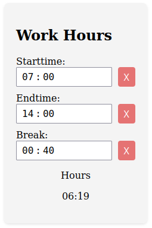

# WorkHours

* simple web app to calculate time differences
* see [demo](https://work-hours-deploy.netlify.app/)
* add additional get parameters like "/?break=00:40&start=07:00&end=14:00"

## Development server

Run `ng serve` for a dev server. Navigate to `http://localhost:4200/`. The application will automatically reload if you change any of the source files.

## Build

Run `ng build` to build the project. The build artifacts will be stored in the `dist/` directory.